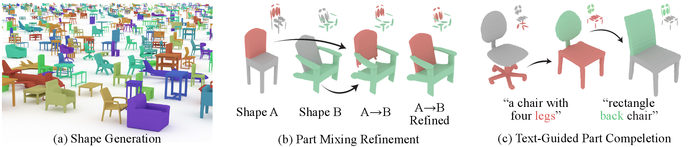

# 🥗 SALAD: Part-Level Latent Diffusion for 3D Shape Generation and Manipulation, ICCV 2023




[**Arxiv**](https://arxiv.org/abs/2303.12236) | [**Project Page**](https://salad3d.github.io/) <br>

[Juil Koo\*](https://63days.github.io/), [Seungwoo Yoo\*](https://dvelopery0115.github.io/), [Minh Hieu Nguyen\*](https://min-hieu.github.io/), [Minhyuk Sung](https://mhsung.github.io/) <br>
\* denotes equal contribution.

### 🎉 This paper got accepted to ICCV 2023!

# Introduction
This repository contains the official implementation of 🥗 **SALAD: Part-Level Latent Diffusion for 3D Shape Generation and Manipulation**.<br>
**SALAD** is a 3D shape diffusion model which generates high-quality shapes and hints its zero-shot capability in various shape manipulation applications. More results can be viewed with a 3D viewer on the [project webpage](https://salad3d.github.io).

[//]: # (### Abstract)
> We present a cascaded diffusion model based on a part-level implicit 3D representation. Our model achieves state-of-the-art generation quality and also enables part-level shape editing and manipulation without any additional training in conditional setup. Diffusion models have demonstrated impressive capabilities in data generation as well as zero-shot completion and editing via a guided reverse process. Recent research on 3D diffusion models has focused on improving their generation capabilities with various data representations, while the absence of structural information has limited their capability in completion and editing tasks. We thus propose our novel diffusion model using a part-level implicit representation. To effectively learn diffusion with high-dimensional embedding vectors of parts, we propose a cascaded framework, learning diffusion first on a low-dimensional subspace encoding extrinsic parameters of parts and then on the other high-dimensional subspace encoding intrinsic attributes. In the experiments, we demonstrate the outperformance of our method compared with the previous ones both in generation and part-level completion and manipulation tasks.

# UPDATES

- [x] Training code of SALAD with Chair class. (May 8th 2023)
- [x] Training code of *text-conditioned* SALAD. (May 8th 2023)
- [x] Demo of *text-guided* shape generation.  (May 8th 2023)
- [x] Code of generation of more classes. (Sep. 17th 2023)
- [x] Demo of part completion.
- [ ] Demo of part mixing and refinement.
- [ ] Demo of text-guided part completion.


# Get Started

## Installation

For main requirements, we have tested the code with Python 3.9, CUDA 11.3 and Pytorch 1.12.1+cu113.

```
git clone https://github.com/63days/salad/
cd SALAD
conda env create -f environment.yml
conda activate salad
pip install -e .
```

## Data and Model Checkpoint
We provide ready-to-use data and pre-trained SALAD and SPAGHETTI checkpoints [here](https://1drv.ms/f/s!AtxL_EOxFeYMk0s3rDbhJORZ6ITD?e=VA09ei). 
Unzip files and put them under the corresponding directories. SPAGHETTI checkpoint directoriess should be under the `SALAD/salad/spaghetti/assets/checkpoints/` directory.


# Training
## Unconditional Generation

You can train models for unconditional generation with airplanes, chairs or tables.
```
python train.py model={phase1, phase2} category={airplane, chair, table}
```

## Text-Guided Generation

For text-guided generation, train a first-phase model and a second-phase model:
```
python train.py model={lang_phase1, lang_phase2}
```

# Demo
## Unconditional Shape Generation

We provide the demo code of unconditional generation with airplanes, chairs and tables at `notebooks/unconditional_generation_demo.ipynb`.

## Text-Guided Shape Generation

We also provide text-guided shape generation demo code at `notebooks/text_generation_demo.ipynb`.


# Citation
If you find our work useful, please consider citing:

```bibtex
@article{koo2023salad,
    title={{SALAD}: Part-Level Latent Diffusion for 3D Shape Generation and Manipulation},
    author={Koo, Juil and Yoo, Seungwoo and Nguyen, Minh Hieu and Sung, Minhyuk},
    year={2023},
    journal={arXiv preprint arXiv:2303.12236},
}
```

# Reference
We borrow [SPAGHETTI](https://amirhertz.github.io/spaghetti/) code from the [official implementation](https://github.com/amirhertz/spaghetti).
